# Money Matters 2.0 — Database Architecture

Status: **Proposed** · Companion to [ARCHITECTURE.md](./ARCHITECTURE.md) · Date: 2026-09-07

> PostgreSQL is not a persistence detail in this system. It **is** the backend: RLS is the
> authorization layer, `CHECK` constraints and triggers are the validation layer, and
> `SECURITY DEFINER` functions are the transactional service layer. Everything in this
> document is therefore load-bearing for correctness and for security, not just for storage.

---

## 1. Design principles

| # | Principle | Consequence in the schema |
|---|---|---|
| P1 | **The ledger is the truth.** There is one ledger, `transactions`, and anything derivable from it is derived. | Account balances are a **view**. Budget "spent" is a **query**. Goal progress is the balance of the goal's wallet — also a view. A goal is the *purpose* of money, never a second balance ([ADR-0026](./adr/0026-goals-are-the-purpose-of-a-wallet.md)). |
| P2 | **The client is never trusted with an authoritative number.** | `gamification_profiles.xp_total` has no `INSERT` grant and no `UPDATE` grant for `authenticated` — a row cannot be *born* with a fabricated total any more than it can be edited into one. Goals carry no amount to forge at all. Tampering is impossible, not merely discouraged. |
| P3 | **Ownership is structural, not conventional.** | Every user table carries `user_id`, has a `UNIQUE (id, user_id)`, and every cross-table reference is a **composite foreign key** `(x_id, user_id)`. A row cannot reference another user's row even if RLS were misconfigured. |
| P4 | **Money is exact.** | `bigint` minor units (paise). No `float`, `real`, or `double precision` anywhere. `numeric` appears only for a confidence score. |
| P5 | **Civil dates and instants are different types.** | `occurred_on date` ("the day I spent it") is separate from `created_at timestamptz` ("when the row was written"). They are never compared. |
| P6 | **Enums for structure, tables for taxonomy.** | `transaction_kind` is an enum: adding a value changes code. `categories` is a table: users add rows and no code changes. v1's `CHECK (category IN (...))` was the wrong side of this line. |
| P7 | **Deny by default.** | `REVOKE ALL … FROM anon, authenticated` on every table, then narrow `GRANT`s. RLS is `ENABLE` **and** `FORCE`. Four explicit policies per table — never `FOR ALL`. |
| P8 | **Forward-only migrations.** | Timestamped SQL in `supabase/migrations/`. A merged migration is immutable; fixes are new files. |

---

## 2. Entity–relationship diagram

```mermaid
erDiagram
    AUTH_USERS ||--|| PROFILES : "1:1 (trigger-created)"
    AUTH_USERS ||--|| GAMIFICATION_PROFILES : "1:1"

    PROFILES ||--o{ ACCOUNTS : owns
    PROFILES ||--o{ CATEGORIES : owns
    PROFILES ||--o{ TRANSACTIONS : owns
    PROFILES ||--o{ BUDGET_PERIODS : owns
    PROFILES ||--o{ GOALS : owns
    PROFILES ||--o{ MERCHANT_RULES : "owns (user rules)"
    PROFILES ||--o{ AUDIT_LOG : "reads own"

    ACCOUNTS ||--o{ TRANSACTIONS : "account_id (source/affected)"
    ACCOUNTS ||--o{ TRANSACTIONS_T : "counter_account_id (transfer dest)"
    CATEGORIES ||--o{ TRANSACTIONS : categorises
    CATEGORIES ||--o{ TRANSACTION_SPLITS : categorises
    CATEGORIES ||--o{ BUDGET_CATEGORY_LIMITS : "limited by"
    CATEGORIES ||--o{ CATEGORIES : "parent_id (future)"

    TRANSACTIONS ||--o{ TRANSACTION_SPLITS : "splits into"
    TRANSACTIONS ||--o| TRANSACTIONS_R : "refund_of_transaction_id"

    BUDGET_PERIODS ||--o{ BUDGET_CATEGORY_LIMITS : contains

    ACCOUNTS ||--o| GOALS : "wallet_account_id (type = wallet, 1:1)"

    GAMIFICATION_PROFILES ||--o{ GAMIFICATION_EVENTS : "aggregated from"
    ACHIEVEMENTS ||--o{ USER_ACHIEVEMENTS : "unlocked as"
    PROFILES ||--o{ USER_ACHIEVEMENTS : earns

    PROFILES {
        uuid id PK
        text display_name
        text timezone "IANA e.g. Asia/Kolkata"
        char currency_code
        smallint budget_period_start_day "1..28"
        timestamptz onboarding_completed_at
    }
    ACCOUNTS {
        uuid id PK
        uuid user_id FK
        text name
        account_type type "cash|bank|savings|wallet|credit_card"
        bigint opening_balance_minor
        bigint credit_limit_minor "credit_card only"
        boolean is_archived
    }
    CATEGORIES {
        uuid id PK
        uuid user_id FK
        text slug "stable machine key"
        text name
        category_kind kind "expense|income"
        category_treatment treatment "fixed|variable|excluded"
        boolean is_system
        boolean is_archived
        smallint position
    }
    TRANSACTIONS {
        uuid id PK
        uuid user_id FK
        uuid account_id FK
        uuid counter_account_id FK "transfer only"
        transaction_kind kind "expense|income|transfer|refund"
        bigint amount_minor "always > 0"
        uuid category_id FK "null for transfer or split"
        date occurred_on "civil user-local"
        transaction_source source
        transaction_status status
        uuid client_request_id "idempotency"
        bytea dedupe_hash "sms/import"
        timestamptz deleted_at
    }
    TRANSACTION_SPLITS {
        uuid id PK
        uuid transaction_id FK
        uuid category_id FK
        bigint amount_minor "sum equals parent amount"
    }
    BUDGET_PERIODS {
        uuid id PK
        uuid user_id FK
        daterange period "half-open non-overlapping"
        bigint expected_income_minor
        bigint planned_fixed_minor
        bigint planned_savings_minor
        bigint rollover_in_minor
        timestamptz closed_at
    }
    BUDGET_CATEGORY_LIMITS {
        uuid id PK
        uuid budget_period_id FK
        uuid category_id FK
        bigint limit_minor
    }
    GOALS {
        uuid id PK
        uuid user_id FK
        uuid wallet_account_id FK "UNIQUE, insert-only"
        text name
        bigint target_minor
        date target_date
        timestamptz archived_at "user-writable"
    }
    GAMIFICATION_PROFILES {
        uuid user_id PK
        integer xp_total "no client UPDATE grant"
        integer current_streak
        date last_check_in_on
    }
    GAMIFICATION_EVENTS {
        uuid id PK
        uuid user_id FK
        gamification_event_type type
        integer xp_awarded
        text dedupe_key "UNIQUE per user"
    }
    ACHIEVEMENTS {
        text code PK
        text name
        integer xp_reward
    }
    USER_ACHIEVEMENTS {
        uuid user_id PK
        text achievement_code PK
        timestamptz unlocked_at
    }
    MERCHANT_RULES {
        uuid id PK
        uuid user_id FK "NULL equals system rule"
        text pattern
        match_type match_type
        text category_slug
        numeric confidence
        smallint priority
    }
    AUDIT_LOG {
        bigint id PK
        uuid user_id
        text table_name
        uuid row_id
        text action
        jsonb changed_fields
    }
```



`TRANSACTIONS_T` and `TRANSACTIONS_R` are the same `transactions` table drawn twice, so the
transfer-destination and refund-parent self-references are visible.

---

## 3. Money representation

### 3.1 The decision

**`bigint`, minor units, currency carried alongside.** `amount_minor = 250000` with
`currency_code = 'INR'` means ₹2,500.00.

| Question | Answer |
|---|---|
| **Precision / scale** | Exact integers. Scale is implied by the currency's ISO 4217 exponent (INR = 2). A currency → exponent map lives in `domain/money`; at MVP it holds one entry. |
| **Range** | ±9 × 10^14 minor units (≈ ₹9 trillion) enforced by `CHECK`. This keeps every value below `Number.MAX_SAFE_INTEGER` (9.007 × 10^15) so PostgREST's JSON-number serialisation of `int8` is lossless. |
| **Rounding** | Rounding happens in exactly two places, both in `domain/money`: `divideFloor` (used by the safe daily limit — always rounds **down**, so the app never encourages overspending) and `allocate` (largest-remainder distribution, so split amounts sum exactly to the parent). No other code rounds. |
| **Arithmetic** | `bigint` in TypeScript. `number` is structurally banned from money paths: `Money` is a branded type and the repository layer is the only converter. |
| **Serialisation** | Wire format is a JSON integer. The mapper asserts `Number.isSafeInteger(row.amount_minor)` and raises a `data_access` error rather than silently truncating. |
| **Display** | `Intl.NumberFormat(locale, { style:'currency', currency })` from `domain/money/format.ts`, always rendered with `font-variant-numeric: tabular-nums`. |
| **Currency handling** | Every money row carries `currency_code`. The `Money` type refuses arithmetic across currencies (throws — it is a programmer error, not a user error). FX conversion is explicitly out of scope; when it arrives it adds a rate table, not a schema rewrite. |

### 3.2 Alternatives considered

- **`numeric(14,2)`** — exact in the database, but PostgREST returns it as a *string* and the
  overwhelmingly common client bug is `parseFloat()` on that string. It also makes every
  arithmetic step in TypeScript a decimal-library call. Rejected: it moves the risk from the
  database (where it was never a problem) into the client (where it is).
- **`double precision`** — what v1's Android `Expense.kt` used. `0.1 + 0.2 ≠ 0.3` is not
  acceptable in a ledger. Rejected outright.
- **`money` type** — locale-dependent, tied to the database's `lc_monetary`, no currency
  awareness. Rejected.
- **`DECIMAL(10,2)`** — v1's web schema. Beyond the string problem, `10,2` caps a value at
  ₹99,999,999.99, which a house down-payment goal can plausibly exceed.

See [ADR-0005](./adr/0005-money-as-bigint-minor-units.md).

---

## 4. Date and time model

Three distinct concepts, three distinct representations. Conflating them caused two of v1's bugs.

| Concept | Type | Example | Rule |
|---|---|---|---|
| **Instant** | `timestamptz` | `created_at`, `updated_at`, `closed_at` | System time. Written by the database (`now()`), never by the client. Never used to decide which day or period a transaction belongs to. |
| **Civil date** | `date` | `occurred_on`, `target_date`, `last_check_in_on` | The user's calendar day in the user's timezone. Timezone-free by construction — a `date` has no instant to convert. |
| **Period** | `daterange` | `budget_periods.period` | Half-open `[start, end)`. Compared with `@>` and `&&`, never with string prefixes. |
| **Zone** | `text` (IANA) | `profiles.timezone = 'Asia/Kolkata'` | The single input that turns an instant into a civil date. Validated by `public.is_valid_timezone()`. |

**The rule:** the client computes `today = LocalDate.inZone(clock.now(), profile.timezone)` once,
in `domain/period`, and sends that `date` to the database. The database never infers the user's day
from `now()` — a server in UTC would file an 11pm IST transaction on the wrong day, which is exactly
what v1 shipped (`toISOString().slice(0,10)` compared against a `timestamptz` string, wrong for
5½ hours of every Indian day).

Behaviour is pinned by tests at `Asia/Kolkata` (UTC+5:30, no DST), `America/Los_Angeles` (DST both
directions), `Pacific/Chatham` (UTC+12:45, fractional offset) and UTC. Full edge-case table in
[FINANCIAL-ENGINE.md §2](./FINANCIAL-ENGINE.md). See [ADR-0006](./adr/0006-occurred-on-date-not-timestamptz.md).

---

## 5. Types and extensions

```sql
create extension if not exists pgcrypto;    -- gen_random_uuid()
create extension if not exists btree_gist;  -- uuid = + daterange && in one EXCLUDE constraint
create extension if not exists pg_trgm;     -- merchant/description search

create type public.account_type            as enum ('cash','bank','savings','wallet','credit_card');
create type public.category_kind           as enum ('expense','income');
create type public.category_treatment      as enum ('fixed','variable','excluded');
create type public.transaction_kind        as enum ('expense','income','transfer','refund');
create type public.transaction_source      as enum ('manual','sms','import','bank_sync','recurring','system');
create type public.transaction_status      as enum ('detected','pending_review','confirmed','rejected','duplicate');
create type public.match_type              as enum ('contains','prefix','exact');
                                           -- 'regex' deliberately absent: ADR-0022
create type public.gamification_event_type as enum (
  'transaction_logged','daily_check_in','goal_contribution','goal_achieved',
  'budget_reviewed','period_under_budget','achievement_unlocked','adjustment');
```

**Why enums here and a table for categories.** An enum value is coupled to code: adding
`transaction_kind = 'loan_repayment'` requires new branches in the balance view, the analytics
query, and the domain layer — the compiler *should* stop you. A category is pure taxonomy; nothing
branches on "Food" vs "Groceries". Enums for the first, rows for the second.

---

## 6. Tables

Conventions applied to **every** user-owned table below, not repeated each time:

- `id uuid primary key default gen_random_uuid()`
- `user_id uuid not null references auth.users(id) on delete cascade`
- `created_at timestamptz not null default now()`, `updated_at timestamptz not null default now()`
  maintained by a shared `set_updated_at()` `BEFORE UPDATE` trigger
- `constraint <t>_id_user_uk unique (id, user_id)` — the composite-FK target (§7)
- RLS enabled **and** forced; four explicit policies (§9)

### 6.1 `profiles`

**Purpose:** per-user settings that every calculation depends on. One row per auth user, created by trigger.

| Column | Type | Null | Default | Notes |
|---|---|---|---|---|
| `id` | `uuid` | no | — | PK, FK → `auth.users(id) ON DELETE CASCADE` |
| `display_name` | `text` | no | `''` | `CHECK (char_length(display_name) <= 80)` |
| `timezone` | `text` | no | `'Asia/Kolkata'` | `CHECK (public.is_valid_timezone(timezone))` |
| `currency_code` | `char(3)` | no | `'INR'` | `CHECK (currency_code ~ '^[A-Z]{3}$')` |
| `locale` | `text` | no | `'en-IN'` | display formatting only |
| `budget_period_start_day` | `smallint` | no | `1` | `CHECK (BETWEEN 1 AND 28)` — 28 so every month has the day |
| `onboarding_completed_at` | `timestamptz` | yes | — | null ⇒ the router sends the user to `/onboarding` |
| `onboarding_version` | `smallint` | no | `1` | lets a future extra step re-open onboarding for existing users |
| `gamification_enabled` | `boolean` | no | `true` | opt-out, honoured server-side by `award_xp` |
| `created_at` / `updated_at` | `timestamptz` | no | `now()` | |

**Indexes:** PK only. **Ownership:** `id = auth.uid()`.

### 6.2 `accounts`

**Purpose:** where money physically sits. Balances are **not** stored here.

| Column | Type | Null | Default | Notes |
|---|---|---|---|---|
| `id`, `user_id` | `uuid` | no | | |
| `name` | `text` | no | | `CHECK (btrim(name) <> '' AND char_length(name) <= 60)` |
| `type` | `account_type` | no | | `cash \| bank \| savings \| wallet \| credit_card` |
| `currency_code` | `char(3)` | no | `'INR'` | |
| `opening_balance_minor` | `bigint` | no | `0` | `CHECK (abs(...) < 900000000000000)`; the balance before the first tracked transaction |
| `credit_limit_minor` | `bigint` | yes | — | `CHECK (>= 0)`; `CHECK (credit_limit_minor IS NULL OR type = 'credit_card')` |
| `institution` | `text` | yes | — | free text, e.g. "HDFC" |
| `last4` | `text` | yes | — | `CHECK (last4 ~ '^[0-9]{4}$')` — display only; a full account number is never stored |
| `is_archived` | `boolean` | no | `false` | archived accounts keep history, disappear from pickers |
| `position` | `smallint` | no | `0` | user ordering |

**Unique:** `(user_id, name)`, `(id, user_id)`, `(id, user_id, type)` — the last is the target of
the type-pinned goal FK (§6.8).
**Index:** `accounts_user_active_idx (user_id, position) WHERE NOT is_archived`.
**Wallets:** `type = 'wallet'` is a container for money with a purpose — an e-wallet balance, or a
pot that backs a goal. It is an ordinary account: its balance is derived, and money enters and
leaves only through `transactions`. A wallet that backs a goal cannot change `type` (the goal's FK
refuses it). See [ADR-0026](./adr/0026-goals-are-the-purpose-of-a-wallet.md).
**Deletion:** `ON DELETE RESTRICT` from `transactions`. An account with history cannot be deleted,
only archived — a deliberate refusal to let one UI action destroy ledger integrity.
**Credit cards:** a purchase is an `expense` on the card account, so the derived balance goes
negative. "Owed" is `-balance`; "available credit" is `credit_limit + balance`. One sign
convention, no special cases in the ledger.

### 6.3 `categories`

**Purpose:** the spending taxonomy. Seeded per user, fully user-editable.

| Column | Type | Null | Default | Notes |
|---|---|---|---|---|
| `id`, `user_id` | `uuid` | no | | |
| `slug` | `text` | no | | stable machine key (`food`, `transport`). `CHECK (slug ~ '^[a-z0-9_]{1,40}$')`. Merchant rules and seeds reference this, never the display name. **Derived from `name` by the `set_category_slug()` `BEFORE INSERT` trigger, not supplied by the client** — it is absent from the client's INSERT and UPDATE grants, which is what makes [API.md §2.4](./API.md)'s `createCategory` input (no `slug` field) implementable |
| `name` | `text` | no | | user-visible; renaming breaks nothing |
| `kind` | `category_kind` | no | `'expense'` | income categories (Salary, Interest) live here too |
| `treatment` | `category_treatment` | no | `'variable'` | `fixed` (rent, EMI, subscriptions), `variable` (discretionary), `excluded` (never counted against a budget — e.g. reimbursable work spend). **The safe daily limit depends on this**: it is what separates committed money from spendable money. See [FINANCIAL-ENGINE.md §3](./FINANCIAL-ENGINE.md) |
| `icon` | `text` | no | `'circle'` | lucide icon name |
| `color` | `text` | no | `'neutral'` | design-token name, **not** a hex value — keeps theming central |
| `is_system` | `boolean` | no | `false` | seeded default. Renameable and archivable, **not** deletable |
| `is_archived` | `boolean` | no | `false` | preserves history; hidden from pickers |
| `position` | `smallint` | no | `0` | ordering |
| `parent_id` | `uuid` | yes | — | future sub-categories; composite self-FK |

**Unique:** `(user_id, slug)`, `(id, user_id)`.
**Index:** `categories_user_active_idx (user_id, kind, position) WHERE NOT is_archived`.
**Deletion:** `ON DELETE RESTRICT` from transactions — deleting a used category is refused and
archiving is offered instead. A system category cannot be deleted at all (`BEFORE DELETE` trigger).
**Seeded defaults** (inserted by `handle_new_user`): expense — `food`, `transport`, `shopping`,
`bills` (**`fixed`**), `entertainment`, `healthcare`, `education`, `travel`, `personal`, `other`;
income — `salary`, `other_income`. All expense categories are seeded `variable` except `bills`;
onboarding invites the user to mark rent/EMI categories as `fixed`, and the safe daily limit
explains which categories it treated as committed.

> **Why per-user rows rather than shared system rows?** A shared table with `user_id IS NULL`
> forces every RLS policy, every FK, and every join to special-case null ownership — and the
> composite-FK technique in §7 stops working entirely. Twelve rows per signup is a rounding error
> against that complexity, and it makes "rename Food to Groceries" a plain `UPDATE`.
> See [ADR-0008](./adr/0008-per-user-seeded-categories.md).

### 6.4 `transactions`

**Purpose:** the ledger. The most important table in the system.

| Column | Type | Null | Default | Notes |
|---|---|---|---|---|
| `id`, `user_id` | `uuid` | no | | |
| `account_id` | `uuid` | no | | the affected account; for a transfer, the **source** |
| `counter_account_id` | `uuid` | yes | — | transfers only: the **destination** |
| `kind` | `transaction_kind` | no | | `expense \| income \| transfer \| refund` |
| `amount_minor` | `bigint` | no | | `CHECK (amount_minor > 0 AND amount_minor < 900000000000000)` — **always positive**; direction comes from `kind`, never from a sign |
| `currency_code` | `char(3)` | no | `'INR'` | |
| `category_id` | `uuid` | yes | — | null for transfers and for split transactions |
| `merchant_label` | `text` | yes | — | normalised merchant name, e.g. `Swiggy` |
| `description` | `text` | no | `''` | `CHECK (char_length(description) <= 280)` |
| `occurred_on` | `date` | no | | civil date in the user's timezone |
| `occurred_at` | `timestamptz` | yes | — | optional precise instant (from SMS/import). Informational; **never** used for period bucketing |
| `source` | `transaction_source` | no | `'manual'` | provenance |
| `status` | `transaction_status` | no | `'confirmed'` | manual rows are born confirmed; ingested rows are born `pending_review` |
| `refund_of_transaction_id` | `uuid` | yes | — | composite self-FK; only when `kind='refund'` |
| `external_ref` | `text` | yes | — | provider/import identifier |
| `dedupe_hash` | `bytea` | yes | — | SHA-256 of `(amount, occurred_on, normalised merchant, last4)` for ingest dedupe. **Not** a hash of the SMS body |
| `client_request_id` | `uuid` | yes | — | client-generated idempotency key |
| `is_split` | `boolean` | no | `false` | trigger-maintained |
| `notes` | `text` | yes | — | |
| `metadata` | `jsonb` | no | `'{}'` | `CHECK (pg_column_size(metadata) < 4096)` — extension point, never load-bearing |
| `created_at`, `updated_at` | `timestamptz` | no | `now()` | |
| `deleted_at` | `timestamptz` | yes | — | soft delete: excluded from every view, recoverable for 30 days |

**Shape constraints** — these are what make a transfer structurally incapable of looking like income:

```sql
constraint tx_transfer_shape check (
  (kind = 'transfer'
     and counter_account_id is not null
     and counter_account_id <> account_id
     and category_id is null)
  or
  (kind <> 'transfer' and counter_account_id is null)
),
constraint tx_category_present check (
  kind = 'transfer' or is_split or category_id is not null
),
constraint tx_split_has_no_direct_category check (not is_split or category_id is null),
constraint tx_refund_shape check (kind = 'refund' or refund_of_transaction_id is null),
constraint tx_occurred_lower_bound check (occurred_on >= date '2000-01-01')
```

> **A constraint we deliberately cannot write.** "`occurred_on` must not be more than 5 years in
> the future" needs `current_date`, which is not `IMMUTABLE`; PostgreSQL rejects it in a `CHECK`.
> It is enforced by the `BEFORE INSERT OR UPDATE` trigger `enforce_transaction_dates()` instead.
> The lower bound *is* immutable and stays a `CHECK`.

**Composite foreign keys** (all `(x, user_id) → (id, user_id)`): `account_id` and
`counter_account_id` → `accounts` (`RESTRICT`), `category_id` → `categories` (`RESTRICT`),
`refund_of_transaction_id` → `transactions` (`SET NULL`).

**Indexes**

```sql
-- transaction list + every period aggregate
create index tx_user_date_idx     on transactions (user_id, occurred_on desc, id desc)
                                  where deleted_at is null;
-- per-account balance, view leg 1
create index tx_user_account_idx  on transactions (user_id, account_id, occurred_on)
                                  where deleted_at is null;
-- per-account balance, view leg 2 (transfers in)
create index tx_user_counter_idx  on transactions (user_id, counter_account_id, occurred_on)
                                  where counter_account_id is not null and deleted_at is null;
-- category breakdown / budget usage
create index tx_user_category_idx on transactions (user_id, category_id, occurred_on)
                                  where deleted_at is null and category_id is not null;
-- the review queue (Milestone 12)
create index tx_review_queue_idx  on transactions (user_id, created_at desc)
                                  where status in ('detected','pending_review');
-- idempotency: the same submit twice is one row
create unique index tx_client_request_uk on transactions (user_id, client_request_id)
                                  where client_request_id is not null;
-- ingest dedupe
create unique index tx_dedupe_uk  on transactions (user_id, dedupe_hash)
                                  where dedupe_hash is not null;
-- search
create index tx_search_trgm_idx   on transactions
  using gin ((coalesce(merchant_label,'') || ' ' || description) gin_trgm_ops);
```

### 6.5 `transaction_splits`

**Purpose:** one purchase, several categories (a ₹3,200 supermarket bill = ₹2,600 groceries + ₹600 household).

| Column | Type | Null | Notes |
|---|---|---|---|
| `id`, `user_id` | `uuid` | no | |
| `transaction_id` | `uuid` | no | composite FK, `ON DELETE CASCADE` |
| `category_id` | `uuid` | no | composite FK, `ON DELETE RESTRICT` |
| `amount_minor` | `bigint` | no | `CHECK (> 0)` |
| `note` | `text` | yes | |

**Unique:** `(transaction_id, category_id)`.
**Integrity:** a `DEFERRABLE INITIALLY DEFERRED` constraint trigger asserts
`sum(splits.amount_minor) = transactions.amount_minor` and maintains `transactions.is_split`.
Deferral matters: inserting three split rows in one batch must validate at **commit**, not after
the first row.

### 6.6 `budget_periods`

**Purpose:** one row per user per financial period. This is what v1 lacked — a single budget row
per user with no period meant budget history did not exist and editing September destroyed August.

| Column | Type | Null | Default | Notes |
|---|---|---|---|---|
| `id`, `user_id` | `uuid` | no | | |
| `period` | `daterange` | no | | half-open `[start, end)`. `CHECK (lower_inc(period) AND NOT upper_inc(period) AND NOT isempty(period))` |
| `expected_income_minor` | `bigint` | no | `0` | `CHECK (>= 0)` — the *plan*, not the sum of income rows |
| `planned_fixed_minor` | `bigint` | no | `0` | rent, EMIs, subscriptions |
| `planned_savings_minor` | `bigint` | no | `0` | pay-yourself-first amount |
| `overall_limit_minor` | `bigint` | yes | — | optional explicit total-spend cap; when null the cap is derived |
| `rollover_enabled` | `boolean` | no | `false` | |
| `rollover_in_minor` | `bigint` | no | `0` | carried surplus/deficit, written by `ensure_budget_period` |
| `closed_at` | `timestamptz` | yes | — | set when the period ends; closed periods are read-only |

**Unique / exclusion:**

```sql
constraint budget_periods_id_user_uk unique (id, user_id),
constraint budget_periods_no_overlap exclude using gist (user_id with =, period with &&)
```

The exclusion constraint is the guarantee that "which period is today in?" always has exactly one
answer — enforced by the database, not by application care. The GiST index it creates also serves
`period @> $today` lookups.

> **No generated `label` column.** The obvious `generated always as (to_char(lower(period),'YYYY-MM')) stored`
> is invalid: `to_char` on a date is `STABLE`, not `IMMUTABLE`, so PostgreSQL rejects it in a
> generated column. The period label is formatted in `domain/period` instead.

### 6.7 `budget_category_limits`

| Column | Type | Null | Notes |
|---|---|---|---|
| `id`, `user_id` | `uuid` | no | |
| `budget_period_id` | `uuid` | no | composite FK, `ON DELETE CASCADE` |
| `category_id` | `uuid` | no | composite FK, `ON DELETE RESTRICT` |
| `limit_minor` | `bigint` | no | `CHECK (>= 0)` |
| `rollover_enabled` | `boolean` | no | per-category rollover |

**Unique:** `(budget_period_id, category_id)`. **Index:** `bcl_period_idx (user_id, budget_period_id)`.

### 6.8 `goals`

**Purpose:** the *purpose* of money. A goal holds no money and stores no amount saved. Every goal
is backed by exactly one wallet (§6.2), and its progress **is** that wallet's balance. Contributing
is a transfer into the wallet; withdrawing is a transfer out; spending the money on its purpose is
an expense from the wallet. See [ADR-0026](./adr/0026-goals-are-the-purpose-of-a-wallet.md), which
supersedes the contribution ledger of [ADR-0010](./adr/0010-goal-progress-trigger-maintained.md).

| Column | Type | Null | Default | Notes |
|---|---|---|---|---|
| `id`, `user_id` | `uuid` | no | | |
| `wallet_account_id` | `uuid` | no | | the backing wallet. **`UNIQUE`** — a wallet backs at most one goal, archived goals included. In the `INSERT` grant, **not** the `UPDATE` grant: re-pointing a goal at a fuller wallet would complete it with no money moving |
| `wallet_account_type` | `account_type` | no | `'wallet'` | `CHECK (wallet_account_type = 'wallet')`. Exists only to carry the type-pinned FK below; absent from both grants, so it always takes its `DEFAULT` |
| `name` | `text` | no | | `CHECK (btrim(name) <> '' AND char_length(name) <= 60)` |
| `target_minor` | `bigint` | no | | `CHECK (> 0 AND < 900000000000000)`, in the wallet's currency |
| `target_date` | `date` | yes | — | |
| `priority` | `smallint` | no | `100` | |
| `archived_at` | `timestamptz` | yes | — | user-writable |

**The type-pinned foreign key.** A composite FK carries ownership (§7); adding the account type
carries "must be a wallet" as well:

```sql
constraint goals_wallet_fk
  foreign key (wallet_account_id, user_id, wallet_account_type)
  references public.accounts (id, user_id, type)
  on delete restrict on update restrict,
constraint goals_wallet_uk unique (wallet_account_id)
```

Pointing a goal at a bank account, pointing it at another user's wallet, and retyping a wallet that
backs a goal are all `23503` at the storage layer — no trigger to forget.

> There is deliberately **no `saved_minor`, no `achieved_at`, no `currency_code`, and no `status`.**
> The amount saved is the wallet's balance; achieved is derived from the wallet's history; the
> currency is the wallet's; status is `archived_at → archived`, else `reached → achieved`, else
> `active`. Every one of those, stored, would be a second fact that could disagree with the ledger.
> v1's `goals.current` was exactly that kind of drift, and it was writable from the browser console.

**`goal_progress`** — the derived read model (a view, §8)

| Column | Meaning |
|---|---|
| `balance_minor` | the wallet's balance from `account_balances` — the amount saved |
| `reached` | the wallet's opening balance, or its running balance on any `occurred_on`, has met `target_minor`. **Sticky:** buying the laptop lowers the balance but does not un-achieve the goal |
| `reached_on` | the first `occurred_on` on which the running balance met the target; `NULL` when not reached, or when the opening balance alone met it |

Nothing here can drift, because nothing here is stored. Editing, deleting or back-dating a
transaction in the wallet changes `balance_minor`, `reached` and `reached_on` on the next read,
which is the correct behaviour for a number derived from the ledger.

**Index:** `goals_user_active_idx (user_id, priority) WHERE archived_at IS NULL`. The per-wallet
aggregates are served by `tx_user_account_idx` and `tx_user_counter_idx` (§6.4).

### 6.9 Gamification tables

**`gamification_profiles`** — one row per user, **read-only to the client**.

| Column | Type | Notes |
|---|---|---|
| `user_id` | `uuid` PK | FK → `auth.users` |
| `xp_total` | `integer` | `CHECK (>= 0)`. Aggregate of `gamification_events.xp_awarded` |
| `current_streak` | `integer` | `CHECK (>= 0)` |
| `longest_streak` | `integer` | `CHECK (>= 0)` |
| `last_check_in_on` | `date` | civil date in the user's timezone |
| `updated_at` | `timestamptz` | |

There is **no `level` column** — level is `floor(xp_total / 100) + 1`, a pure function in
`domain/gamification/levels.ts`. v1 stored both `xp` and `level` and they could disagree.

**`gamification_events`** — append-only; the audit trail behind every XP point.

| Column | Type | Notes |
|---|---|---|
| `id`, `user_id` | `uuid` | |
| `type` | `gamification_event_type` | |
| `xp_awarded` | `integer` | `CHECK (>= 0)` |
| `dedupe_key` | `text` | e.g. `check_in:2026-09-07`, `tx:<uuid>`. **`UNIQUE (user_id, dedupe_key)`** |
| `occurred_on` | `date` | |
| `context` | `jsonb` | small, non-sensitive |

The unique `dedupe_key` is the whole anti-farming mechanism: logging the same transaction twice,
retrying a failed request, or replaying a captured call all collide on the same key and award zero
additional XP. XP is **idempotent by construction**, not by client discipline.

**`achievements`** (global catalog: `code` PK, `name`, `description`, `icon`, `xp_reward`,
`sort_order`, `is_active`) and **`user_achievements`** (`user_id` + `achievement_code` composite PK,
`unlocked_at`). Adding an achievement is an `INSERT` into the catalog plus a predicate in
`domain/gamification/achievements/catalog.ts` — never a schema change.

### 6.10 `merchant_rules`

**Purpose:** merchant → category suggestion, shared by the client (typing a description), the
future SMS parser, and any future import.

| Column | Type | Null | Notes |
|---|---|---|---|
| `id` | `uuid` | no | |
| `user_id` | `uuid` | **yes** | `NULL` = system rule readable by everyone; non-null = the user's own override |
| `pattern` | `text` | no | normalised, lower-cased token |
| `match_type` | `match_type` | no | `contains \| prefix \| exact`. No `regex` — see [ADR-0022](./adr/0022-drop-regex-match-type.md) |
| `merchant_label` | `text` | no | canonical display name (`Swiggy`) |
| `category_slug` | `text` | no | resolved to *the user's* category by slug at match time |
| `confidence` | `numeric(3,2)` | no | `CHECK (BETWEEN 0 AND 1)`; below the auto-apply threshold the UI asks |
| `priority` | `smallint` | no | lower wins; user rules seeded at 10, system rules at 100 |
| `is_enabled` | `boolean` | no | |

**Why `category_slug` and not `category_id`:** a system rule (`user_id IS NULL`) cannot reference
any particular user's category row. The slug resolves per user at match time, which also means a
user who renamed "Food" to "Eating out" still gets correct suggestions.

**Index:** `mr_lookup_idx (user_id NULLS LAST, priority) WHERE is_enabled`, plus
`mr_pattern_trgm_idx USING gin (pattern gin_trgm_ops)`.

This is the **only** table shared between users, and it contains no user data. It also carries no
ReDoS surface: `regex` matching was dropped from `match_type` before implementation
([ADR-0022](./adr/0022-drop-regex-match-type.md)), which retires threat T17 in
[SECURITY.md §5](./SECURITY.md) rather than mitigating it. `pattern` is still capped at 100
characters, so a reintroduction starts from a bounded input.

### 6.11 `audit_log`

`id bigint generated always as identity`, `user_id`, `table_name`, `row_id`, `action`
(`insert|update|delete`), `changed_fields jsonb`, `actor uuid`, `created_at`.

Written by a `SECURITY DEFINER` trigger on `transactions`, `budget_periods`,
`budget_category_limits`, and `goals`. The client has **`SELECT` only** on
its own rows and no write grant at all. This is what answers "why did my budget change?" and
"what did I edit last Tuesday?" without a second system.
**Index:** `audit_user_time_idx (user_id, created_at desc)`. Retention: 24 months, then pruned.

---

## 7. Cross-table integrity: composite foreign keys

RLS stops a user *reading* another user's rows. It does **not**, on its own, stop a user
*referencing* one. Consider a plain `category_id uuid references categories(id)`: user A can
`INSERT` a transaction whose `user_id` is A (passing `WITH CHECK`) and whose `category_id` belongs
to user B. The insert succeeds — the FK only checks that the category *exists*, and A's `SELECT`
policy is never consulted for the referenced row. A now holds a transaction pointing into B's data,
and B's category can no longer be deleted for reasons B cannot see.

**The fix is structural.** Every referenceable table carries `UNIQUE (id, user_id)`, and every
reference is composite:

```sql
alter table public.transactions
  add constraint tx_account_fk
      foreign key (account_id, user_id)
      references public.accounts (id, user_id) on delete restrict;
```

The foreign key now carries the ownership assertion. Referencing another user's account is a
`23503` foreign-key violation at the storage layer — before RLS, before triggers, before any
application code, and regardless of whether a policy was written correctly.

| Reference | Composite FK target | On delete |
|---|---|---|
| `transactions.account_id` | `accounts (id, user_id)` | `restrict` |
| `transactions.counter_account_id` | `accounts (id, user_id)` | `restrict` |
| `transactions.category_id` | `categories (id, user_id)` | `restrict` |
| `transactions.refund_of_transaction_id` | `transactions (id, user_id)` | `set null` |
| `transaction_splits.transaction_id` | `transactions (id, user_id)` | `cascade` |
| `transaction_splits.category_id` | `categories (id, user_id)` | `restrict` |
| `budget_category_limits.budget_period_id` | `budget_periods (id, user_id)` | `cascade` |
| `budget_category_limits.category_id` | `categories (id, user_id)` | `restrict` |
| `goals.wallet_account_id` | `accounts (id, user_id, type)` — type pinned to `'wallet'` (§6.8) | `restrict` |
| `categories.parent_id` | `categories (id, user_id)` | `set null` |

Cost: one extra unique index per table and a slightly unusual DDL idiom. Benefit: the
highest-severity class of bug in a multi-tenant financial app becomes unrepresentable.
See [ADR-0009](./adr/0009-composite-foreign-keys.md).

**The defence stack, in execution order:**

1. Zod schema (client) — fast feedback, **not** a security control
2. `GRANT`s — may this role touch this table/column at all?
3. RLS `USING` / `WITH CHECK` — is this row mine?
4. Composite FK — does this reference stay inside my tenant?
5. `CHECK` constraints — is this row internally coherent?
6. Triggers — are the cross-row invariants still true?
7. `SECURITY DEFINER` RPC — is this multi-step operation atomic?

Layers 2–7 all run server-side. Deleting layer 1 changes the user experience, not the security.

---

## 8. Derived data: views, not columns

```sql
-- One row per (transaction, affected account). A transfer produces two rows with opposite
-- signs, which is precisely why a transfer can never appear as income or expense.
create view public.account_entries with (security_invoker = true) as
  select t.user_id, t.account_id, t.id as transaction_id, 'primary'::text as leg,
         t.occurred_on, t.currency_code,
         case t.kind
           when 'income'  then  t.amount_minor
           when 'refund'  then  t.amount_minor
           else                -t.amount_minor          -- expense, transfer-out
         end as signed_amount_minor
    from public.transactions t
   where t.deleted_at is null and t.status = 'confirmed'
  union all
  select t.user_id, t.counter_account_id, t.id, 'counter',
         t.occurred_on, t.currency_code, t.amount_minor  -- transfer-in
    from public.transactions t
   where t.kind = 'transfer' and t.counter_account_id is not null
     and t.deleted_at is null and t.status = 'confirmed';

create view public.account_balances with (security_invoker = true) as
  select a.user_id, a.id as account_id, a.currency_code,
         a.opening_balance_minor + coalesce(sum(e.signed_amount_minor), 0) as balance_minor
    from public.accounts a
    left join public.account_entries e on e.account_id = a.id
   group by a.user_id, a.id, a.currency_code, a.opening_balance_minor;

-- Splits and un-split transactions unified, so every analytics query has one shape.
create view public.transaction_category_amounts with (security_invoker = true) as
  select t.user_id, t.id as transaction_id, t.occurred_on, t.kind,
         coalesce(s.category_id, t.category_id) as category_id,
         coalesce(s.amount_minor,  t.amount_minor) as amount_minor
    from public.transactions t
    left join public.transaction_splits s on s.transaction_id = t.id
   where t.deleted_at is null and t.status = 'confirmed'
     and t.kind in ('expense','income','refund');

-- A goal's progress is its wallet's balance. `reached` is sticky: it asks whether the running
-- balance EVER met the target, so spending the money on its purpose does not un-achieve the goal.
create view public.goal_progress with (security_invoker = true) as
  with running as (
    select e.account_id, e.occurred_on,
           sum(sum(e.signed_amount_minor))
             over (partition by e.account_id order by e.occurred_on) as net_to_date_minor
      from public.account_entries e
     where e.account_id in (select g.wallet_account_id from public.goals g)
     group by e.account_id, e.occurred_on
  )
  select g.user_id, g.id as goal_id, g.wallet_account_id, b.currency_code, g.target_minor,
         b.balance_minor,
         a.opening_balance_minor >= g.target_minor
           or exists (select 1 from running r
                       where r.account_id = g.wallet_account_id
                         and a.opening_balance_minor + r.net_to_date_minor >= g.target_minor)
           as reached,
         case when a.opening_balance_minor < g.target_minor then
           (select min(r.occurred_on) from running r
             where r.account_id = g.wallet_account_id
               and a.opening_balance_minor + r.net_to_date_minor >= g.target_minor)
         end as reached_on
    from public.goals g
    join public.accounts a         on a.id = g.wallet_account_id
    join public.account_balances b on b.account_id = g.wallet_account_id;
```

`security_invoker = true` (PostgreSQL 15+) makes a view run with the **querying user's** privileges,
so the underlying RLS policies still apply. A view without it runs as its owner and silently becomes
an RLS bypass. This flag is a security control, not a style choice; its presence on every view is
asserted by a CI check over `pg_class.reloptions`.

**Nothing derived is stored** except `gamification_profiles.xp_total` (§6.9) and
`transactions.is_split` (a boolean used only to pick a query shape). Every other number — account
balance, goal progress, budget spent, category totals, savings rate, XP level — is computed from the
ledger at read time. That is the
answer to "where can money become inconsistent?": almost nowhere, because almost nothing is
duplicated.

**When this stops scaling** (assumption A7 breached): `get_period_summary` becomes a read of a
`period_rollups` table maintained by a trigger or a nightly job. Because clients already call an
RPC rather than aggregating rows themselves, that change is invisible above the data layer.

---

## 9. Row-Level Security

Complete policy design, per-command rationale and the grant matrix live in
[SECURITY.md §4](./SECURITY.md); the negative-test matrix and the CI schema assertions are
[SECURITY.md §8](./SECURITY.md). The invariants:

- Every table in `public` has `ENABLE ROW LEVEL SECURITY` **and** `FORCE ROW LEVEL SECURITY`.
  A CI query fails the build if any table in `public` has `relrowsecurity = false` **or**
  `relforcerowsecurity = false`.
- No `FOR ALL` policies. Four named policies per user table, each `TO authenticated`.
- Every `INSERT`/`UPDATE` policy has a `WITH CHECK`. A `USING`-only `UPDATE` policy lets a user
  move a row *out* of their own tenant — v1 had exactly this shape.
- `anon` holds no grant on any application table.
- Derived/authoritative columns are protected by **column-level grants on `INSERT` as well as
  `UPDATE`**, because RLS operates on rows and cannot express "you may write this row but not that
  column" — and because a row can be born wrong as easily as it can be edited wrong
  ([ADR-0019](./adr/0019-insert-column-grants.md)).
- Server-side writes go through `SECURITY DEFINER` functions whose owner holds `BYPASSRLS`. That
  fact is what makes `FORCE ROW LEVEL SECURITY` compatible with trigger-maintained columns, and it
  is asserted in CI ([ADR-0020](./adr/0020-rls-execution-model.md)).

---

## 10. Functions and triggers

The **Security** column is load-bearing, not documentation. A function that writes a column absent
from the caller's grant must be `SECURITY DEFINER` or it fails with `42501`; a definer function
whose owner cannot write through RLS fails *silently*. Both are verified behaviours — see
[ADR-0020](./adr/0020-rls-execution-model.md).

| Object | Kind | Security | Executable by | Purpose |
|---|---|---|---|---|
| `is_valid_timezone(text)` | `IMMUTABLE` fn | invoker | `authenticated` | validates an IANA zone against `pg_timezone_names` |
| `set_updated_at()` | `BEFORE UPDATE` trigger | invoker | trigger only | maintains `updated_at` on every table. Assigns `NEW` only, so no column privilege is required |
| `set_category_slug()` | `BEFORE INSERT` trigger | invoker | trigger only | derives `categories.slug` from `name`; the client never supplies it (§6.3) |
| `handle_new_user()` | `AFTER INSERT ON auth.users` | **definer** | trigger only | creates `profiles`, `gamification_profiles`, and the 12 seed categories in one transaction. Writes tables with no client policy, so definer is mandatory |
| `enforce_transaction_dates()` | `BEFORE INS/UPD` trigger | invoker | trigger only | rejects an absurd future `occurred_on` (the bound a `CHECK` cannot express). Raises only; writes nothing |
| `enforce_split_total()` | `DEFERRABLE` constraint trigger | **definer** | trigger only | `sum(splits) = transaction.amount_minor`; maintains `is_split`, which is absent from the client's grants |
| `award_xp(type, dedupe_key, xp, ctx)` | internal fn | **definer** | internal only — no grant | the **only** writer of `gamification_events` and `xp_total`; idempotent on `dedupe_key`; enforces the per-day caps in [FINANCIAL-ENGINE.md §6](./FINANCIAL-ENGINE.md); no-ops when `gamification_enabled = false` |
| `on_transaction_awards_xp()` | `AFTER INSERT` trigger | invoker | trigger only | calls `award_xp('transaction_logged', 'tx:'||new.id, …)`, which elevates. A transfer into a goal's wallet is awarded as `goal_contribution` (`contrib:<id>`) instead, and the first transaction that makes `goal_progress.reached` true awards `goal_achieved` (`goal:<goal id>`) — [ADR-0026](./adr/0026-goals-are-the-purpose-of-a-wallet.md) |
| `evaluate_achievements(p_user_id)` | internal fn | **definer** | internal only — no grant | unlocks catalog achievements whose predicate now holds. Takes a user id because its only callers are definer functions that have already derived `auth.uid()`; never granted to `authenticated` ([SECURITY.md §4.5](./SECURITY.md) rule 2) |
| `audit_row()` | `AFTER INS/UPD/DEL` trigger | **definer** | trigger only | writes `audit_log`, which has no client write grant |
| `recompute_xp_totals(p_user_id default null)` | maintenance fn | **definer** | `service_role` only | recovery path for `gamification_profiles.xp_total`, rebuilt from `gamification_events` — the system's one remaining cache ([ARCHITECTURE.md §R.1, §R.15](./ARCHITECTURE.md)) |
| `prevent_system_category_delete()` | `BEFORE DELETE` trigger | invoker | trigger only | protects seeded categories. Raises only |

Every `SECURITY DEFINER` function is written with `SET search_path = ''` and fully-qualified object
names — a `search_path` hijack is the classic `SECURITY DEFINER` privilege escalation. Every one
that is callable by a client re-derives the caller from `auth.uid()` rather than trusting a
`user_id` argument; the two that take a user id are never granted to `authenticated`, and a CI
query in [SECURITY.md §8.2](./SECURITY.md) asserts that.

---

## 11. RPC surface (the transactional API)

Signatures, errors, and authorization in [API.md §4](./API.md).

| Function | Why it must be an RPC rather than a REST write |
|---|---|
| `ensure_budget_period(p_today date)` | Creating "this month's budget" on first load of a new month is a race between two devices. `INSERT … ON CONFLICT DO NOTHING` inside the function makes it idempotent, and it carries the previous plan and rollover forward. |
| `get_period_summary(p_from date, p_to date)` | Server-side aggregation: income/expense/fixed/variable totals plus per-category sums in one result set, instead of shipping rows to the browser to `reduce`. |
| `get_dashboard_snapshot(p_today date)` | One round trip for the whole dashboard — period, plan, totals, budget usage, goal summaries, gamification. Removes a 7-request waterfall on the slowest screen on the slowest network. |
| `daily_check_in(p_today date)` | The streak transition is computed in SQL from `last_check_in_on`; the function clamps to at most one increment and rejects a `p_today` outside a narrow window around the server date, so a client cannot inflate a streak. |
| `record_transaction_review(p_transaction_id, p_decision)` | *(Milestone 12)* Confirm/reject an ingested transaction atomically with its dedupe bookkeeping. |
| `delete_my_account()` | *(Edge Function, service role)* Cascade-delete every row and the auth user itself. |

---

## 12. Concurrency

| Scenario | Mechanism |
|---|---|
| **Two contributions to one goal at once** | Two transfers into the goal's wallet are two independent `INSERT`s. No lock is needed: progress is the wallet's balance, a sum computed at read time, so there is no stored total to lose an update to. |
| **The same transaction submitted twice** (double tap, retry, two devices) | `client_request_id` is generated once per form submission and reused across retries. `UNIQUE (user_id, client_request_id)` turns the second write into a `23505`, which the repository maps to "already saved" and returns the existing row. Idempotency, not after-the-fact deduplication. |
| **Two edits to the same transaction** | Optimistic concurrency on `updated_at`: `UPDATE … WHERE id = $1 AND updated_at = $2`. Zero rows ⇒ `conflict` ⇒ the UI shows "this changed elsewhere; reload". Last-write-wins is not acceptable on money. |
| **Two devices creating this month's budget** | `ensure_budget_period` plus the `EXCLUDE USING gist` overlap constraint. Worst case, one transaction gets `23P01` and retries into the winner's row. |
| **Duplicate SMS/import** *(future)* | `dedupe_hash` partial unique index, plus a fuzzy pass (same amount, same account, `occurred_on` within one day, similar merchant) that marks the newer row `status='duplicate'` rather than dropping it — a wrong dedupe decision must be visible and reversible. |
| **XP double-award** | `UNIQUE (user_id, dedupe_key)` on `gamification_events`. Replaying a captured request awards nothing. |
| **Concurrent budget edits** | The same `updated_at` optimistic check as transactions. |
| **Isolation level** | Default `READ COMMITTED` everywhere. The row locks and unique constraints above are sufficient; none of the RPCs perform a read-then-write that a unique index or `FOR UPDATE` does not already protect, so `SERIALIZABLE` and its retry loops are not needed. |

---

## 13. Migrations

```
supabase/migrations/
  20260910120000_extensions_and_types.sql
  20260910120100_profiles.sql
  20260910120200_accounts.sql
  20260910120300_categories.sql
  20260910120400_gamification.sql            ← tables + award_xp only; surfaces are M9 (ADR-0016)
  20260910120500_signup_trigger.sql          ← handle_new_user: needs all four tables above
  20260910120600_transactions.sql
  20260910120700_transaction_splits.sql
  20260910120800_budget_periods.sql
  20260910120900_goals.sql
  20260910121000_merchant_rules.sql
  20260910121100_views.sql
  20260910121200_rpcs.sql
  20260910121300_rls_policies.sql
  20260910121400_audit_log.sql
```

> **Why the signup trigger is not in the `profiles` migration.** `handle_new_user()` writes
> `profiles`, `gamification_profiles` and twelve `categories` rows in one transaction, so all three
> tables must already exist. An earlier draft of this list created the trigger at `120100` and the
> categories it inserts at `120300`, which cannot apply from zero. Splitting the trigger into its
> own file is what makes "every migration applies to an empty database" (rule 2 below) true.

1. **Forward-only.** A migration merged to `main` is never edited. Fix with a new file.
2. **Applies from zero on every PR.** CI creates an empty database, applies every migration in
   order, then runs the RLS suite against it. A migration that only works against *your* database
   is not a migration.
3. **Generated types are committed.** `supabase gen types typescript` output is checked in; CI
   regenerates and fails on a diff, so a schema change with stale types cannot merge.
4. **Destructive changes are two-phase.** Add column → backfill → switch reads → drop the old
   column in a *later* release. Never `DROP COLUMN` in the same deploy that stops using it.
5. **RLS-affecting migrations need two approvals** ([CONTRIBUTING.md](./CONTRIBUTING.md)).
6. **`db/*` branches** carry migrations, so two features adding tables produce two files, not a
   conflict.

---

## 14. What v1's schema got wrong, and where each is fixed

| v1 | Problem | Fixed by |
|---|---|---|
| `expenses` only | No income, no transfers, no accounts. Moving money to savings looked like spending. | §6.4 `transactions` with `kind` + `counter_account_id` |
| `DECIMAL(10,2)` read into a JS `Number` | Float arithmetic on money; ₹100M ceiling | §3 `bigint` minor units |
| `CHECK (category IN (…))` | A user category needs a migration | §6.3 `categories` table |
| `budgets` with `UNIQUE(user_id)`, no period | No budget history; editing September destroyed August | §6.6 `budget_periods` |
| `goals.current` client-writable | `UPDATE goals SET current = target` from the console | §6.8 — a goal stores no amount; progress is its wallet's ledger balance |
| `profiles.xp`, `profiles.level` client-writable | `xp = 999999` from the console; xp and level could disagree | §6.9 events + `award_xp` + derived level |
| `FOR ALL USING (auth.uid() = user_id)` | No `WITH CHECK` ⇒ rows could be inserted owned by someone else | [SECURITY.md §4](./SECURITY.md) |
| `date timestamptz` compared to `toISOString().slice(0,10)` | "Today" meant UTC-today — wrong for 5½ hours of every IST day | §4 `occurred_on date` + user timezone |
| FKs to `auth.users` with no `ON DELETE` action | Deleting a user failed or orphaned rows | `ON DELETE CASCADE` throughout |
| No indexes beyond primary keys | Sequential scans on every query | §6 index list |
| No audit trail | "Why did my budget change?" unanswerable | §6.11 `audit_log` |
